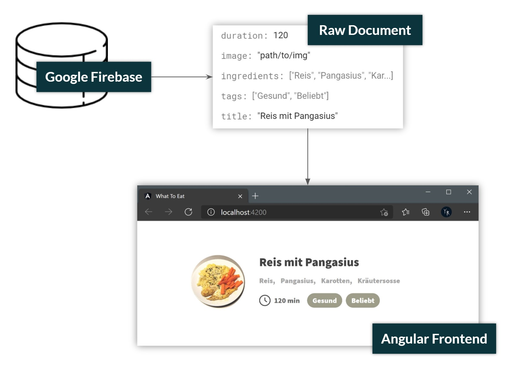
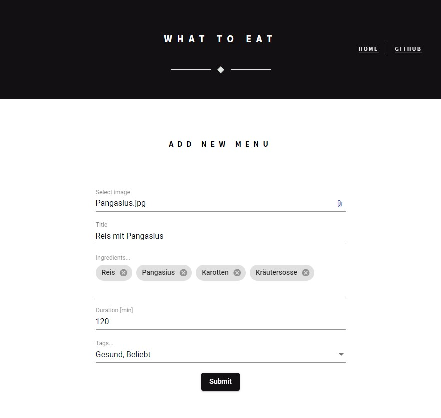

# What To Eat - Source Code

List of menu ideas that aims to stop time being wasted on the always recurring question: 'What to eat?'  
This project illustrates how to build a full-fledged web application using google firebase as the backend server and angular as the frontend client.

## Setup
   

  

## Adding New Menu
 

  

## Resources
 

- [Google Firebase](https://firebase.google.com/)

- [Angular Fire - Github](https://github.com/angular/angularfire)

- [Angular CDK Virtual Scroll - Fireship.io](https://fireship.io/lessons/infinite-virtual-scroll-angular-cdk/)

- [Angular Material - Getting Started](https://v7.material.angular.io/guide/getting-started)

- [Angular Reactive Forms](https://angular.io/guide/reactive-forms)

- [Material File Input - npmjs](https://www.npmjs.com/package/ngx-material-file-input)

- [Angular Firebase File Upload - Github](https://github.com/fireship-io/168-multi-file-upload-angular-firebase)
